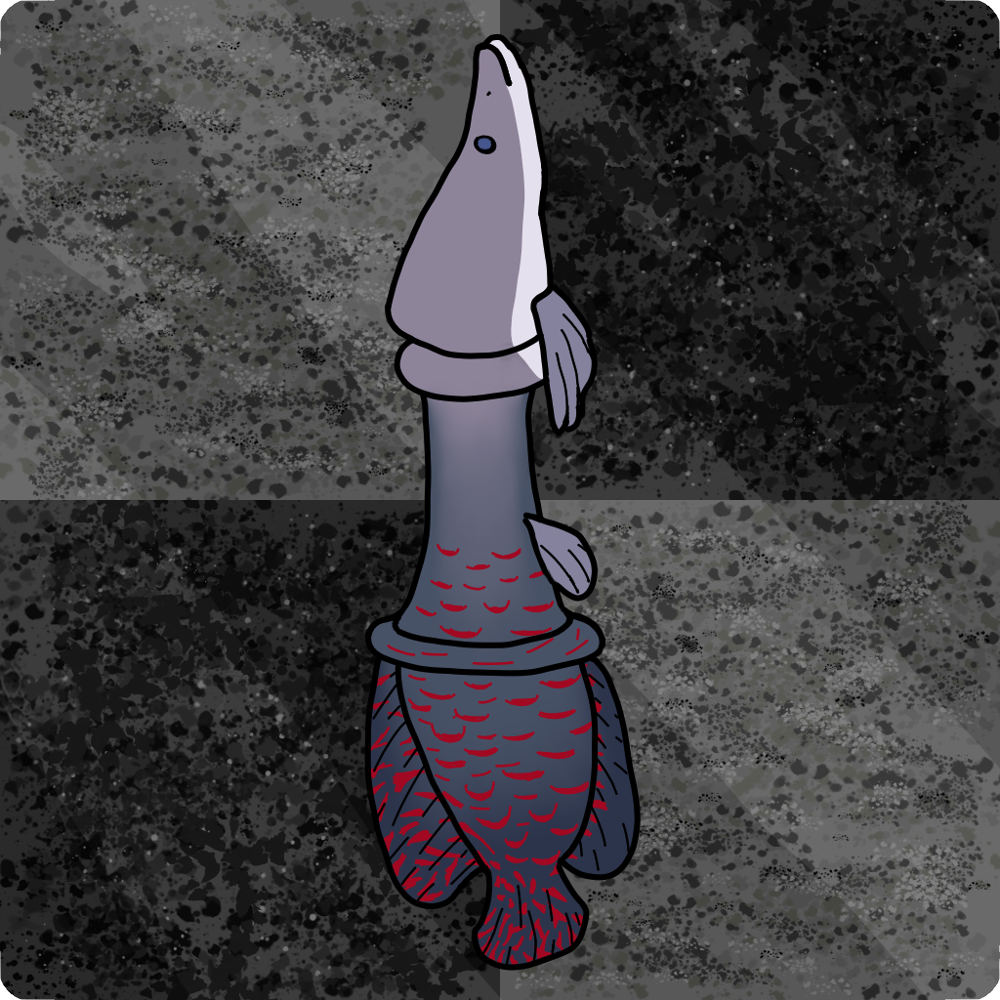

  ArapaimaChessWebGUI

  

  A simple web interface for a chess engine made in C++
</p

### Overview

This project sets up a single page app for playing against [ArapaimaChess](https://github.com/devLIPEr/ArapaimaChess/) engine using HTML, CSS and JavaScript for interactions.

The engine was recompiled with [emscripten](https://emscripten.org/) for web support using WebAssembly. The interface uses [chessboardjs](https://github.com/oakmac/chessboardjs) for the graphical board and [chess.js](https://github.com/jhlywa/chess.js) for validation of moves.

### Attributions

[Go back icons created by Freepik - Flaticon](https://www.flaticon.com/free-icons/go-back)

[Flag icons created by Freepik - Flaticon](https://www.flaticon.com/free-icons/flag)

[Refresh icons created by Freepik - Flaticon](https://www.flaticon.com/free-icons/refresh "https://www.flaticon.com/free-icons/refresh")
